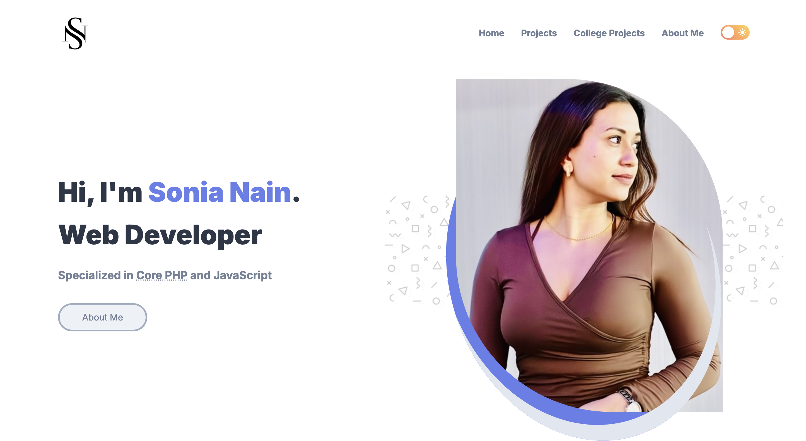
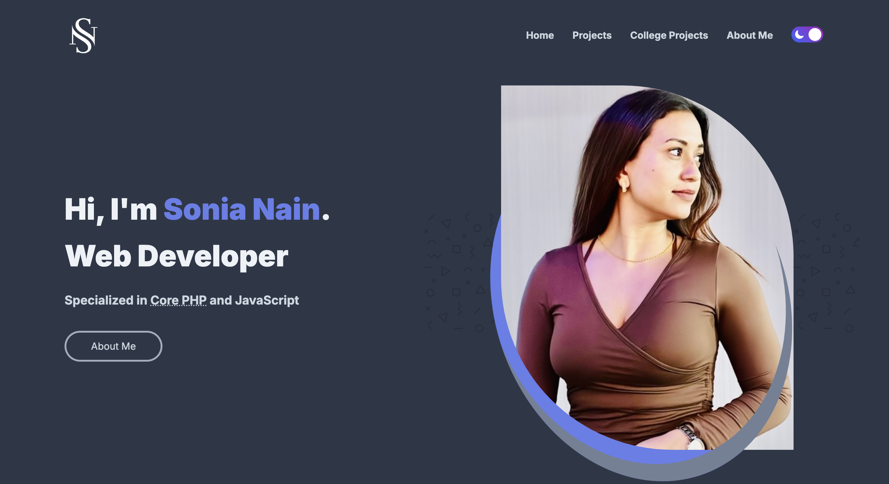

# DevBlog's Portfolio





---

## About
A portfolio website showcasing the projects and skills of Sonia Nain, a web developer specializing in Core PHP and JavaScript. Built using HTML, CSS, Tailwind CSS, JavaScript, and session storage.

## Live Demo
View the live project [here](https://sonia364.github.io/developer_profile/).

## Features
- Responsive design
- Projects showcase
- About me section
- Theme toggle with session storage

## Installation
1. Clone the repository
   ```sh
   git clone https://github.com/sonia364/developer_profile.git

2. Navigate to the project directory
    ```sh
    cd developer_profile
3. Open index.html in your browser

## Usage
- Theme Toggle: Click the theme button to toggle between light and dark themes.
- Mobile Navigation: Click the menu button to open/close the navigation.
- View Projects: Browse the projects section for links and details.

## Contact
Created by [Sonia Nain](mailto:nainsonia92@gmail.com) - feel free to contact me!
